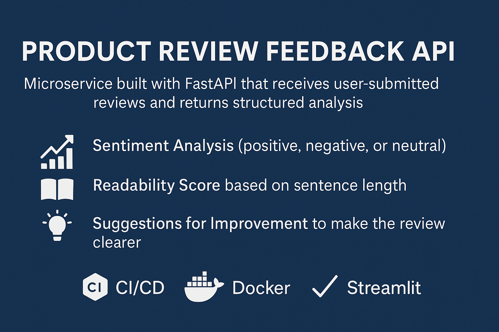

# Product Review Feedback Microservice

Un microservicio en FastAPI que analiza reseñas de productos y devuelve:
- Sentimiento (positivo, negativo, neutral)
- Puntuación de legibilidad
- Sugerencias de mejora

## 🚀 Instalación rápida

```bash
docker-compose up --build
```

Visita la documentación interactiva en: [http://localhost:8000/docs](http://localhost:8000/docs)

## 🧪 Tests

```bash
docker-compose run api pytest
```

## 🧠 Futuras Extensiones de IA

- Modelos NLP reales (HuggingFace, spaCy)
- IA generativa (GPT, LLaMA)
- Integración CI/CD

## 🖥 Interfaz Visual (Opcional)

```bash
streamlit run streamlit_app.py
```

## 🤖 Herramientas Usadas

- GitHub Copilot
- ChatGPT

## 📄 Presentación

Consulta la presentación en PDF en el archivo:
**InVitro_Case_Study_Presentation.pdf**
