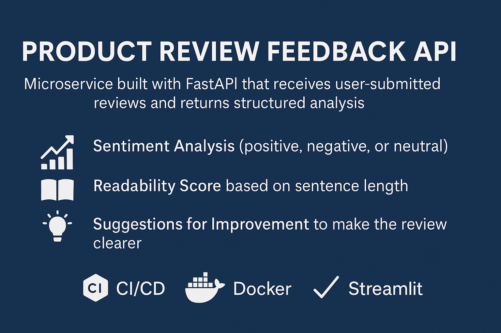

# Product Review Feedback Microservice

A microservice built with **FastAPI** to analyze user-submitted product reviews and return structured feedback:

- 🎯 Sentiment classification (positive, negative, neutral)
- 📚 Readability score (based on average sentence length)
- 💡 Suggestions to improve the review text

---

## 🚀 Quick Start

```bash
docker-compose up --build
```

Open Swagger UI at: [http://localhost:8000/docs](http://localhost:8000/docs)

---

## 📬 Example Usage

### 🔹 From Swagger

Go to `/review`, click **Try it out**, and enter:

```json
{
  "content": "It was a nice product. I loved how easy it was to use!"
}
```

You’ll receive a response like:

```json
{
  "sentiment": "positive",
  "readability_score": 6.5,
  "suggestions": "Looks good!"
}
```

### 🔹 From Python

```python
import requests

response = requests.post("http://localhost:8000/review", json={
    "content": "The product was terrible, dirty and frustrating to use."
})
print(response.json())
```

---

## 🧠 How It Works

- All input is normalized: **lowercased and stripped of punctuation**
- Sentiment is rule-based using extended sets of positive/negative keywords
- Readability is based on words per sentence
- Suggestions detect long reviews or excessive capitalization

---

## 🧪 Run Tests

```bash
docker-compose run api pytest
```

---

## 🖥 Visual Interface (Optional)

```bash
streamlit run streamlit_app.py
```

---

## 🤖 AI Tools Used

- GitHub Copilot (scaffolding, logic suggestion)
- ChatGPT (architecture, README, CI/CD setup)

---

## 📄 Presentation

Included in:
**InVitro_Case_Study_Presentation.pdf**
